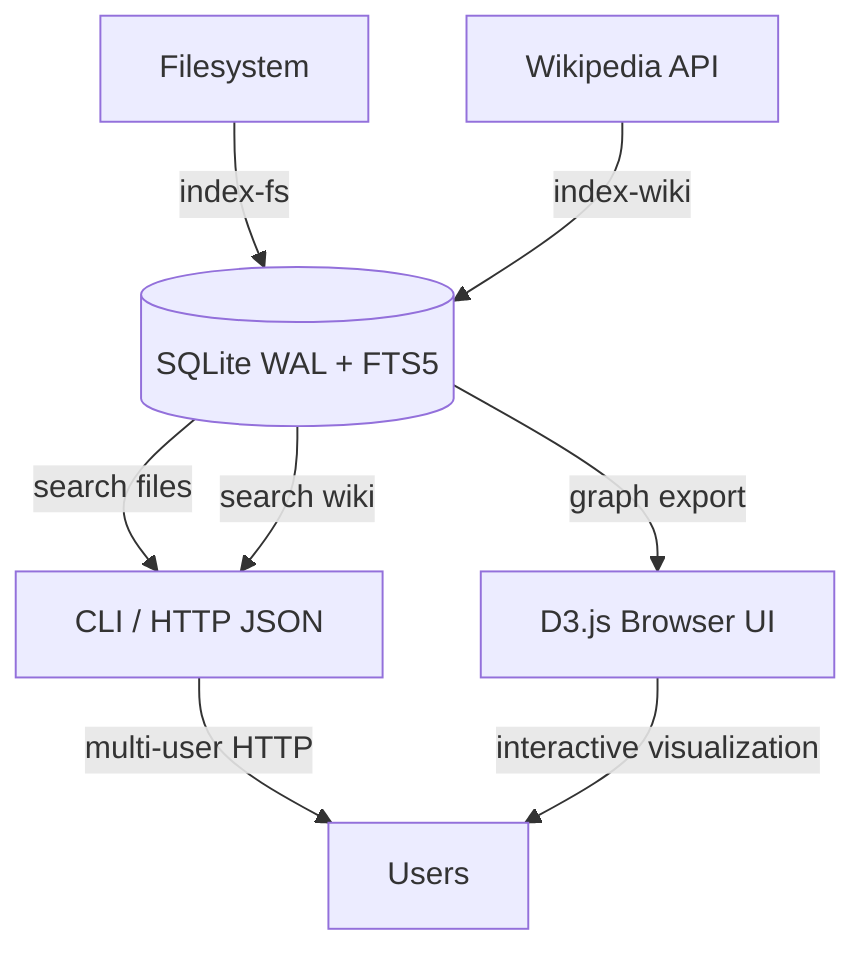

# Hyper Index Orchestrator

This repository packages a full-stack indexing workflow that can profile a local filesystem, ingest interconnected Wikipedia concepts, and explore the resulting knowledge base via command-line, HTTP, and browser-based visualization layers.

## Quick start

```bash
# 1. Ensure prerequisites, bootstrap the DB, index the repo, and fetch a Wikipedia seed
./hyper_index.sh quickstart

# 2. Run the bundled smoke tests
./hyper_index.sh auto-test

# 3. Launch the multi-user API and bundled UI on http://localhost:8765
./hyper_index.sh serve --host 0.0.0.0
```

Open a browser to `http://localhost:8765` and search across the indexed filesystem or navigate the concept graph. The UI automatically calls the `/search` and `/graph` endpoints exposed by the Bash orchestrator.

## Automated install, diagnostics, and debugging

| Command | Purpose |
| --- | --- |
| `./hyper_index.sh doctor` | Verifies `sqlite3` (with FTS5), `python3`, and network connectivity to Wikipedia. |
| `./hyper_index.sh quickstart` | Initializes the SQLite database, indexes the repo with size-limited hashing, seeds Wikipedia data, and runs the doctor checks. |
| `./hyper_index.sh auto-test` | Performs a non-destructive smoke test in a temporary database to ensure all critical commands execute. |
| `./hyper_index.sh auto-debug` | Reports record counts and highlights FTS rows that may have fallen out of sync. |

For convenience a `Makefile` mirrors these flows:

```bash
make install   # -> doctor
make test      # -> auto-test
make debug     # -> auto-debug
make run       # -> serve
```

## Architecture overview



Key design elements:

- **SQLite FTS5 + WAL** for low-latency search and concurrent HTTP reads.
- **Python workers** embedded inside the Bash CLI to batch inserts and interact with external APIs.
- **ThreadingHTTPServer** providing `/search`, `/graph`, and `/health` endpoints, plus static hosting for the `web/` UI.
- **D3.js front-end** that renders force-directed graphs from the `/graph` endpoint and surfaces search results in real time.

## Command reference

- `init` – create the persistent database schema (idempotent).
- `index-fs` – walk a directory tree, store metadata, and push file paths into an FTS index.
- `index-wiki` – recursively ingest a concept and its links from Wikipedia.
- `search <domain> <query>` – query either `files` or `wiki` indices via the CLI.
- `visualize <concept>` – export a `dot` or JSON graph for offline tooling.
- `stats` – display aggregate row counts.
- `doctor`, `quickstart`, `auto-test`, `auto-debug` – automation commands described above.
- `serve` – expose the HTTP API and host the visualization assets in `web/`.

All commands honour `HYPER_INDEX_DB` so you can isolate experiments.

## Front-end explorer

The `web/` directory hosts a zero-dependency UI:

- **Search panel** – issues `/search` requests against the chosen domain and prints formatted results.
- **Concept graph panel** – calls `/graph` and uses D3 to draw a draggable force-directed network, highlighting the root concept.

Because the HTTP server is multi-threaded, multiple browsers can connect concurrently.

## References

- [SQLite FTS5 Extension](https://www.sqlite.org/fts5.html) – powering the file and concept search indices.
- [MediaWiki Action API](https://www.mediawiki.org/wiki/API:Main_page) – used for Wikipedia ingestion.
- [D3.js Force Layout](https://observablehq.com/@d3/force-directed-graph) – inspiration for the front-end visualization.

