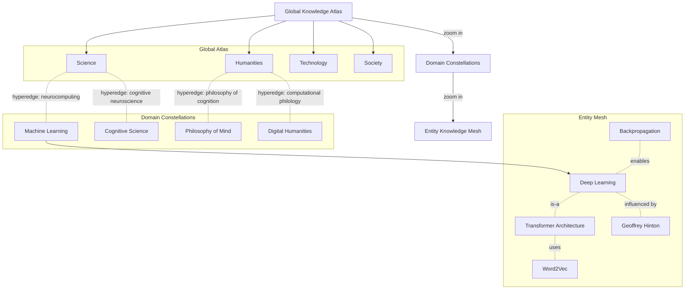

# Optimal Semantic Search Hypergraph Visualization

This document outlines an approach for visualizing and navigating a semantic search engine that spans the entire scope of Wikipedia down to individual entities. The design focuses on representing semantic relationships as a navigable hypergraph and supporting zooming interactions from global knowledge domains to granular concepts.

## Conceptual Layers

The visualization is organized into three nested layers that share a common hypergraph data model.

1. **Global Knowledge Atlas**  
   * Nodes: high-level domains (e.g., *Science*, *Culture*, *Technology*).  
   * Hyperedges: ontological bridges that capture multidisciplinary links (e.g., *Neuroscience* linking *Biology* and *Computer Science*).  
   * Visual treatment: continent-like regions on a globe or force-directed map.  

2. **Domain Constellations**  
   * Nodes: subdomains, disciplines, and thematic clusters (e.g., *Machine Learning*, *Cognitive Science*).  
   * Hyperedges: conceptual frameworks, standards, or shared methodologies.  
   * Visual treatment: constellation maps where clusters share glowing halos and edges vary by semantic strength.

3. **Entity Knowledge Mesh**  
   * Nodes: fine-grained Wikipedia pages (people, places, algorithms, datasets).  
   * Hyperedges: typed relationships (is-a, part-of, influenced-by, cites, temporal adjacency).  
   * Visual treatment: detailed network where the user can filter by relation type and metadata facets.

## Interaction Model

* **Semantic Zooming:** Smooth transitions between layers; as the user zooms in, nodes split into their constituent hyperedges and child nodes. Zooming out aggregates related nodes into higher-order concepts.  
* **Lens-Based Filtering:** A movable semantic lens highlights nodes matching search queries or ontology filters, adjusting opacity for non-relevant nodes.  
* **Time Slider:** Animates historical evolution of concepts, showing when ideas emerged or gained prominence.  
* **Narrative Trails:** Users can pin a path through the hypergraph to create storylines or curricula (e.g., "Foundations of Deep Learning").

## Diagram

## Search Experience

1. **Query Composition**  
   * Natural language queries are embedded into the hypergraph space.  
   * The interface highlights matching nodes and hyperedges across all layers.  

2. **Contextual Insights**  
   * Hover cards display summaries, key references, and related entities.  
   * Breadcrumbs track the zoom path and allow quick navigation back to broader topics.  

3. **Exploratory Analytics**  
   * Heatmaps reveal areas dense with recent scholarly activity.  
   * Semantic similarity sliders let users broaden or narrow the scope of results.

## Implementation Considerations

* **Data Ingestion:** Combine Wikipedia categories, Wikidata ontologies, citation graphs, and external taxonomies to construct typed hyperedges.  
* **Storage:** Use a graph database with hyperedge support or model hyperedges via edge-entity pattern.  
* **Rendering:** WebGL-based force simulation with hierarchical edge bundling for clarity.  
* **Scalability:** Incremental loading and level-of-detail techniques ensure smooth zooming across millions of entities.

## Use Cases

* Exploring complex fields like deep learning to see foundational research, influential people, and key datasets.  
* Building personalized learning pathways by traversing narrative trails.  
* Identifying interdisciplinary connections that might inspire new research or products.

## Future Enhancements

* Collaborative layers where multiple users annotate and share semantic trails.
* AI-guided recommendations that suggest unexplored branches based on user intent.
* Integration with knowledge-grounded chat interfaces for conversational exploration.

## Prototype Implementation

An executable prototype now lives in `semantic_search_engine/`. It wires together three knowledge sources (local docs, curated
scientific papers, and representative web snippets) into a hypergraph and exposes four competing semantic search strategies:

1. **Vector Semantic Search** — builds a TF-IDF index across all nodes and ranks hits by weighted term frequency.
2. **Graph Traversal Search** — propagates relevance over hyperedges to surface contextually connected entities.
3. **Ontology Lens Search** — applies ontology-style tag filters for faceted discovery.
4. **Hybrid Self-Improving Search** — ensembles the other strategies and continuously adjusts weights using an evaluation
   league.

Run `python -m examples.run_demo` to execute a league round, print each strategy's precision, and preview the JSON payload that
visualization clients can consume.
